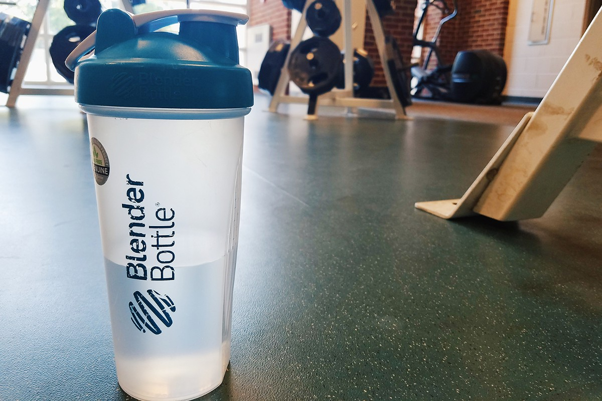
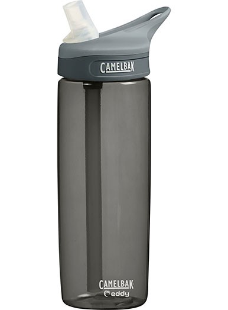
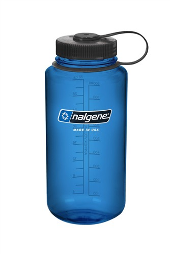
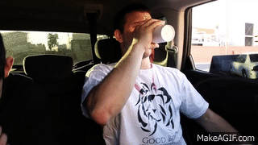
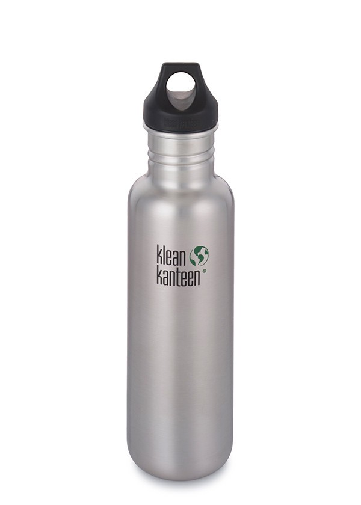
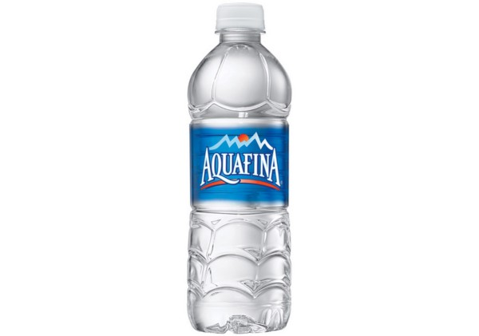
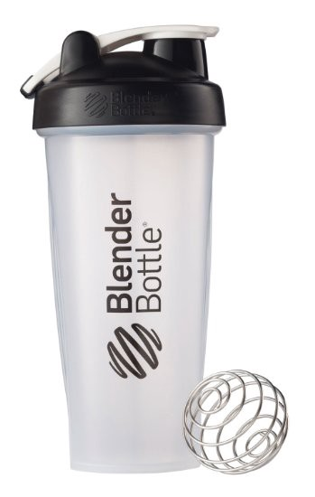

Hydration is no joke, and unless you have the water-retention of a camel, you’re probably drinking water throughout the day, and for more than just survival. I drink water for exercise, for wrinkle-prevention, for taking vitamins, and especially for washing down the Papa John’s that I had for dinner.

As a college student, I’m always looking for ways to get my daily 8 glasses. The bookstore is stocked with a huge selection of water bottles, some plain, some fancy, but I’m here to tell you that when it comes to water, none of them come close to The King: The Blender Bottle.

Now you might be wondering why I’m pitching a gym accessory as the best water bottle. You’re thinking, _I don’t go to the gym, I’m here to drink water, not pump iron._ And I don’t blame you, because rarely does someone buy a shaker bottle unless they subscribe to a philosophy consisting of protein shakes, weightlifting, and all things Nike/Adidas/LuluLemon. Besides, with brands like CamelBak, Nalgene, and Contigo lining the shelves at your local supermarket, why bother with alternatives?

To demonstrate my point, let’s examine some of the most popular waterbottles out in the wild, and highlight the strengths and weaknesses of each…

#### [CamelBak Eddy](https://www.amazon.com/CamelBak-Eddy-Water-Bottle-75-Liter/dp/B00NTYIHNQ/ref=sr_1_1?s=sporting-goods&ie=UTF8&qid=1472330824&sr=1-1&keywords=camelbak+eddy) (\$12.74)

These are everywhere on college campuses. Lots of schools have their name printed on the bottle, which makes you feel special, but in reality it just makes it 100 times more likely to get mixed up with someone else’s. People love the retractable nipple straw, the gravity-defying contraption allows you to drink without tilting your head, and it doesn’t spill! This feature works for all of 2 months before the inside of the nipple starts turning yellow with bacteria. You promise yourself that you will clean it with a q-tip, since the school-branded edition costs almost \$20, but it just ends up in the trash with the rest of your freshman freebies.

#### [Nalgene Wide Mouth](https://www.amazon.com/Nalgene-32oz-Tritan-Mouth-Bottle/dp/B0028O5RTK/ref=sr_1_5?s=sports-and-fitness&ie=UTF8&qid=1472330862&sr=1-5&keywords=nalgene) (\$11.35)

A true classic. You’ll get a lot of hikers and bikers telling you 10 reasons why they love their nalgene, but those are people who really must carry a large volume of water. For the average person, the extra 8 or so ounces that you get with the nalgene can’t make up for its biggest weakness: the wide mouth. You can’t help but laugh because it’s even in the name, but anyone who’s used a nalgene has had this happen to them.

#### [Klean Kanteen](https://www.amazon.com/Klean-Kanteen-Classic-Bottle-27-Ounce/dp/B0093IQYQ4/ref=sr_1_1?s=sporting-goods&ie=UTF8&qid=1472330894&sr=1-1&keywords=klean%2Bkanteen) (\$16.80)

The most beautiful bottle on this list, and it better be. At $17, this is practically the Mercedes of water bottles, and it’s not even the insulated version. Without insulation, the stainless-steel construction of this bottle is rendered virtually worthless since your hot beverages will become lukewarm just like that. Even if $17 is chump change to you, remember that you have to unscrew the lid every time you want to drink. Kanteen fans who don’t like that buy the sport nozzle cap, but that’s as unsatisfying as taking a shower under a faucet. Not to mention that this bottle will dent, and when it does **_everyone_** will hear it.

#### Bottled Water (Varies)

The old-standby. Because this is 100% spring water right? Research shows that only 55% of bottled water comes from spring water, and the rest is mostly treated tap water. Not only are you paying ridiculous amounts of money for slightly-better sink water, everybody knows that bottled water is terrible for the environment. But before you start reusing those bottles out of guilt, remember that the plastics used in bottled water are not designed to be reused, as they will degrade and leak cancerous particles.

### Let’s Summarize

While each of the bottles above have their distinct fatal flaws, we can draw some general lessons about features that a _good_ water bottle should have:

1.  A small opening for sipping
2.  A large opening for filling and cleaning
3.  No gimmicky parts that can break or trap bacteria
4.  Cheap and durable

It’s astonishing how all of these cultural-icons of water storage fail to meet such simple criteria, yet everybody still uses them. Granted, there are absolutely days that I could use a bottle with a straw or a disposable water bottle, but for an average person who just needs to get some water in his system, the Blender Bottle reigns supreme. Let’s go over some specifics:

- Holds 28 oz, only 4 oz less than the Nalgene
- Large screw-lid for pouring and cleaning
- Small snap-cap for drinking
- BPA-free and dishwasher-safe
- Translucent so you can see what you’re drinking

So here’s a bottle that has all the basic characteristics of a good water bottle, and you can buy it for only \$7.89 on [Amazon](https://www.amazon.com/BlenderBottle-Classic-Shaker-Bottle-Clear/dp/B00MVMCUK8/ref=sr_1_2?ie=UTF8&qid=1472330244&sr=8-2&keywords=blender+bottle)? Notice that I haven’t even mentioned that it can blend your protein shakes yet. Now that you know the facts, here’s what you should do:

- Buy one for yourself and all your friends, multipacks are even cheaper!
- Calculate your recommended daily water intake [here](http://www.bodybuilding.com/fun/water_calculator.htm).
- Follow me on Medium!
- Heart this article and recommend it to all your friends!
