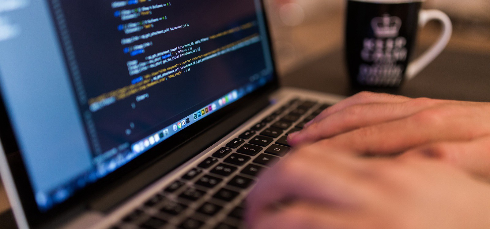
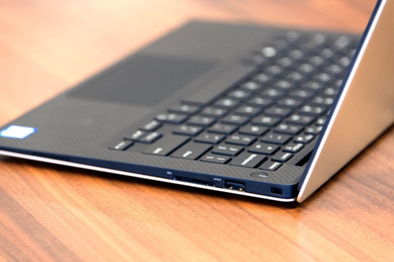
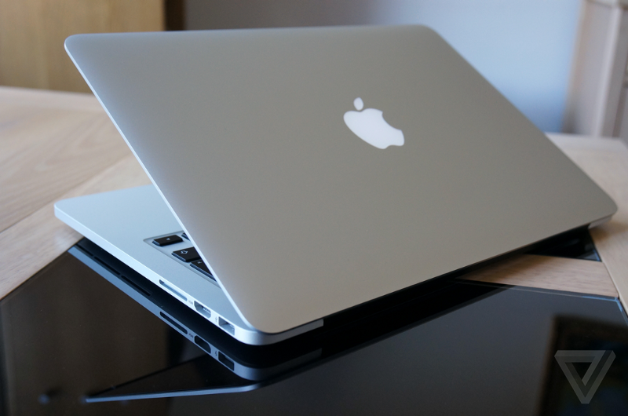

From Windows 98 to Windows 10, I was born and raised a PC. My dad was a PC, and his daddy before him. (I think they called it Windows BC back then) Joking aside, I considered myself a power user, did everything from gaming to photo-editing to coding on Windows machines, and was proud of it. So why, you might ask, did someone like me switch to Mac?

Truth is, I didn’t. To be specific, I only switched from using a Dell XPS 13 to the 2015 Retina MacBook Pro 13". My PC brethren can sit back down, because I still do all my gaming and intense work on my self-built desktop PC. But for a college student, you can see how changing your laptop can be a huge deal. My laptop is what I use for taking notes in class, what I take with me back home and on trips, and the only thing I truly love in this world. While my XPS 13 was great for all of these things, I sold it after a year for the MacBook Pro, all because I heard other software developers preferred it. It’s now been 3 weeks, so what do I think, and how does it compare to my previous laptop, which was voted #1 Windows ultrabook of 2015/2016?

  
_XPS 13 (\$1100 w/ Student Discount):\*\* Intel Skylake i5 2.3GHz, 8GB RAM, 256GB SSD, 1920x1080 resolution._

  
_MacBook Pro 13" (\$1400 w/ Student Discount):\*\* Intel Broadwell i5 2.7GHz, 8GB RAM, 256GB SSD, 2650x1600 resolution._

**The Good:** I mean yeah, it’s beautiful. Apple’s build quality has been unparalleled for years, and the only Windows laptops I would compare to MacBook build quality are the Surface series. The XPS 13 had a beautiful design with a similar chassis and slim bezels, but it didn’t feel as solid as the MBP. Does it really matter? No, but hey, you can open the lid with one hand! The retina display has a 2560x1600 resolution, which is roughly 1440p, and it’s a real winner as well. It might not be as crispy as the 4K displays on other laptops, but it strikes a balance between detail and power efficiency while still looking great for movies and photos. An important distinction to draw between MacBook Pros and most Windows ultrabooks is that the former uses 28W processors while the latter is usually rocking a 15W processor. What that means for the consumer is that MacBooks are much more capable for intensive tasks like video editing and compiling large programs.

**The Bad:** I was surprised to find out how crappy the speakers were. They’re much bigger than the ones on the XPS 13, but produce a tinny sound that is really only acceptable for casual YouTube. Meanwhile the XPS speakers were powerful for its size, and produced clear albeit small sound. Chrome performance has improved in recent updates, but is still a huge battery hog on MacOS. Apple veterans will tell you that Safari is much smoother and gives you insane battery life, but as a web developer, that’s more of a compromise than a benefit. Android compatibility is terrible, as you have to download an app just to transfer files, and it only supports drag and drop up to 4GB (what??).

**The Surprising:** Now here’s a shocker, the Mac trackpad isn’t noticeably any better than the modern Microsoft precision trackpad. Mac users have always enjoyed their buttery smooth scrolling and gestures, but with the precision trackpad, the same gestures are available in Windows. Show all programs? 3 finger swipe up. Swipe between desktops? 4 finger slide. There are also a few things that I feel MacOS is better off copying Windows:

- Dedicated “Delete” Key: No I don’t want to press fn-delete to backspace forwards.
- Put the command key in the left corner: Why is this a thing? It’s just as awkward to press cmd+c/cmd+f with my pinky+index as it is with my ring+index. So I swapped fn and cmd with [Karabiner](https://github.com/tekezo/Karabiner-Elements).
- Window Snapping: This, my friends, is why so many mac users browse the internet with the browser occupying only part of the screen. There is no proper maximize button, and you can’t drag windows to the sides of the screen for multitasking. Install [Magnet](https://www.google.com/url?sa=t&rct=j&q=&esrc=s&source=web&cd=8&cad=rja&uact=8&ved=0ahUKEwiP0LDrhIfRAhUEPiYKHSpUBGkQFgg-MAc&url=https%3A%2F%2Fitunes.apple.com%2Fus%2Fapp%2Fmagnet%2Fid441258766%3Fmt%3D12&usg=AFQjCNHoGhrSE_GXgkTMGY3YuQ1tpuAWIA&sig2=k3qxSyDjdUkgr1vigfF9jA) (\$.99) from the app store to fix this ridiculousness.
- No volume control via HDMI: Apple decided that you shouldn’t be able to control the volume from your computer when linked to a speaker via HDMI. [Soundflower](https://rogueamoeba.com/freebies/soundflower/) is an acceptable workaround.

### Conclusion

I’ll admit, it’s been hard accepting my new MacBook Pro. Sure, Macs were much more reliable 8 years ago, but in this race, it’s Windows that’s the turtle, making slow but steady progress toward a friendlier user experience, especially when you purchase a premium device.

Would I recommend the MacBook Pro? If you want a laptop for web browsing, listening to music, and schoolwork, _no._ Google Chrome performance is much better on Windows, and the combination of window snapping and multiple desktops make PC’s as productive if not more than their Mac counterparts. Microsoft Office was not really designed with Macs in mind, and it really shows. The MacBook is much more suited for someone who prefers Apple-proprietary software, such as Safari, Final Cut, and Pages. At the end of the day, it’s really the marriage between software and hardware that truly makes Mac shine. The Sierra update brings a host of benefits to iPhone/Apple Watch users, and it’s obvious that you can’t fully enjoy one iDevice without having them all.

So what makes the MBP worth it for me? **Native UNIX**. As a hobby and professional programmer, being able to work in a native UNIX environment is truly a gift. Virtual machines aren’t as smooth, and Linux lacks a lot of popular software, making MacOS the next best thing for people who need the command line on a daily basis. [HomeBrew](http://brew.sh/) is a must-have for package management, and it even handles my app installations like Skype, Slack, and VLC. With Mac, I can develop code in NodeJS, edit photos in Photoshop, and work on essays in Microsoft Word all within the same OS, and that is why I’m sticking with the MacBook Pro.

If you have tips and tricks for improving the Mac experience, or want to share your thoughts on the Mac vs. PC debate, please share!
