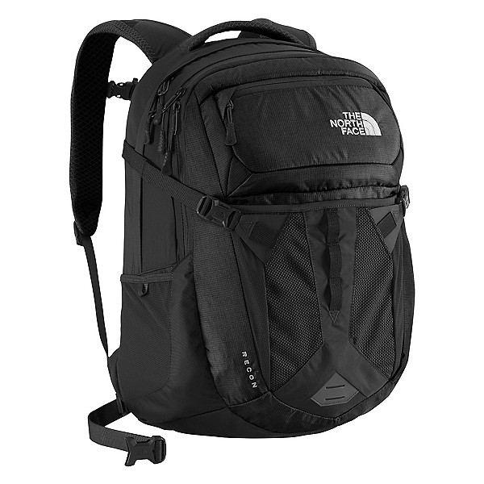

I’ve been traveling a lot lately. Most of these trips have been short, just 1 or 2 nights, so I travelled with just a backpack, but my latest trip to San Francisco and Boston challenged me to live out of that backpack for 7 days. It’s really gotten me to think about the basic necessities and how to fit them in one bag.

This is the bag that I’ve been traveling with, the North Face Recon.

In my day-to-day, this is my backpack for school, which holds my laptop, charger, several notebooks, pencils, and a Kindle. It’s got plenty of organization compartments, which is ideal for a student, but not well suited for travel. The top-loading design forces you to dig around for items at the bottom of the bag, which is fine for notebooks and documents, but incredibly inconvenient for rolled up clothing. It’s my only bag with a laptop compartment, and easily held gear for a 2~3 day trip, but I got really worried when I found out I’d be living out of it for 7 days across San Francisco and Boston.

Now when I say “live out of”, what I really mean is carrying all the supplies I can’t get from a hotel, notably clothes, toiletries, and tech. While that might just sound like bringing more clothes compared to a 2-day trip, what it also means is that if I can wash my clothes every 7 days, I can theoretically live out of this bag for as long as I want. With that goal in mind and the pieces I already own, here is my packing list and some critique on each part.

#### **Outerwear**

- Hoodie (Worn on flight)

The hoodie was very useful for keeping me warm on the flight, and even fended off the wind and light drizzle in Boston. I had no room in my backpack, so I just wrapped it around my waist when it got toasty. For colder climates and better water-resistance I would’ve gone with a Patagonia Nano-Puff hoodie.

#### **Tops**

- 2x Icebreaker Merino Tech-Lite T-Shirt (Wore one on flight)
- Kent Wang Polo
- American Eagle Button Down
- Abercrombie Short-Sleeve Henley

The merino t-shirts are the hero here. They dry fast, don’t smell, and feel super soft, which makes them ideal for multi-day wear. The most I’ve ever pushed it is around 6 days, at which point they definitely smelled used, but not gross. I travelled with a polo and button down for the interview and other more formal occasions, but I could’ve easily replaced them with one more merino item to save space.

#### **Underwear and Socks**

- 4x Boxer Briefs (Wore one on flight)
- 2x Darn Tough Merino Socks
- 2x Nike Crew Socks (Wore one on flight)
- 1x Dress Socks

Again, merino wool is what allows me to pack less and last longer. I still packed a pair of dress socks for the interview, but I could probably replace the Nike’s with 1 more pair of merino socks.

My underwear has no features for travel, so I’m looking to replace them with a couple of quick-drying ones. ExOfficio has been known for their hand-washable underwear, but I’ve heard of some quality issues lately. NatGeo recommends Saxx, but for merino underwear I’ve heard good things about Unbound.

#### **Bottoms**

- Outlier Slim Dungarees
- Oliver’s Apparel All Over Short (Worn on flight)

Outlier pants are crazy expensive, but they’re just as good as merino in terms of odor-control and drying time. The slim dungarees are as tough as jeans, but they could pass as informal slacks in a tech interview, so they are my go-to pants. For hotter climates and the flight, I wear Oliver’s All Over Short, a low-key athletic short that wicks moisture and is super-stretchy. They don’t flop around like basketball shorts, and have plenty of pocket room unlike soccer shorts. My biggest complaint is that they pill in the butt like crazy, so I’ll probably be replacing them with Outlier New Way shorts.

#### **Shoes**

- Adidas Ultraboost 1.0 (Worn on flight)
- Stafford Wingtip Dress Shoes

Ultraboosts are undoubtedly the most comfortable shoes I’ve ever owned. The primeknit upper conforms to your feet like a sock and is super breathable, but what really makes this shoe is the boost foam. It really feels like walking on a cloud, which for urban settings gives me all-day endurance. They’re white, so I have to try really hard to keep them clean, which is why I’ll probably buy my next pair in black or gray. I’ve heard good things about Allbirds and their merino wool upper, but the look is questionable in my opinion.

I brought a pair of cheap dress shoes for the interview, but only because I knew I wouldn’t be judged for the quality of my footwear. Thankfully, bringing a beater dress shoe allows me to abuse them on the street and cram them into whatever space will fit in my bag.

If I could only bring 1 pair of shoes, it would be sneakers. However, the ultraboosts don’t blend well with slim dungarees, so for versatility with shorts and pants, I would go with the Converse Chuck 2 with the Lunerlon insole or the Vans New Era with superfeet insoles. If I could bring 2 pairs of shoes, I would replace the wingtips with a pair of dress boots or loafers.

#### Toiletries

- Kose Softymo Speedy Cleansing Oil
- Hada Labo Gokujyun Hyaluronic Lotion Moist
- CosRx Advanced Snail Mucin Power Essence
- Toothbrush (Obtained from hotel)
- Toothpase (Obtained from hotel)
- Tongue brush
- Gatsby Gray Hair Wax
- Skin Aqua UV Super Moisture Milk SPF 50+
- Razor

Not much to say about toiletries, since everyone’s is different, but I had to stay under 100mL due to carry-on restrictions. I did this by decanting larger containers into 2oz amber bottles. They were too big, made of glass, and had no easy way to dispense, so I will be replacing them with MUJI frosted plastic travel containers. With these new containers, all of the items above would fit into a pencil pouch that I can slide into the mesh pocket of my backpack. This is all assuming that I get access to shampoo, towels, and a hairdryer at my destination. If not I’d have to bring a larger toiletry bag and a travel towel.

#### Final Thoughts

I was really impressed by how much the North Face Recon could hold; it was 100% sufficient for a 7-day trip like this, staying at hotels and friend’s apartments. To be fair, it is advertised as a 30L bag, but I found that the 24.6L Aer Duffel Pack 2 could hold even more. That being said, neither of these bags had any more room for a camera or larger toiletry kit, both of which I would bring on an international trip. I’ll be taking a 15 day trip to Japan in January, so my quest continues for the perfect bag…
