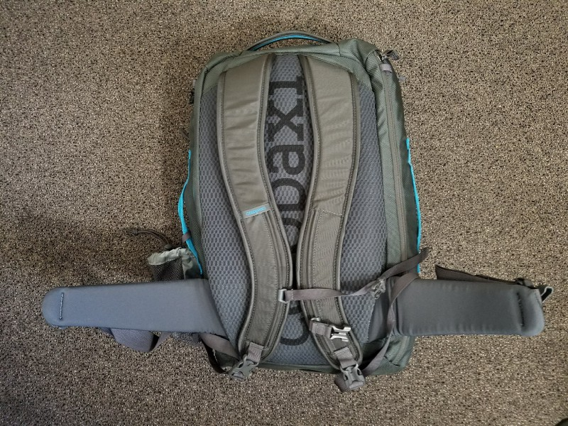

  
_Mount Fuji as seen from the town of Hakone_

This past winter break, I had the pleasure of experiencing Japan on a two-week trip with friends. It was a trip that I had been looking forward to for a long time, spending hours researching the culture, picking attractions, and booking accommodations. This resulted in an itinerary spanning 8 cities in 15 days, a pace I’ve never traveled at before. It got me thinking about my packing style, which usually consisted of a schoolbag and a large suitcase, and how cumbersome it would be to lug that across 8 cities. Thus began my journey down the rabbit hole that is onebag travel: the practice of traveling with a single backpack. People have all kinds of reasons for traveling like this, from saving on baggage fees to minimalism, but I had one goal in mind, which was to minimize the annoyances of dealing with big and bulky luggage, such as finding elevators, squeezing through tight spaces, and fatigue.

### Finding the One Bag

#### Act I: The North Face Recon

My first candidate was the backpack that I already owned and brought to class every day, the North Face Recon. As an experiment, I brought it as my only luggage on a 7-day trip to San Francisco and Boston to find out just how far I can stretch the capabilities of this bag. Last October, I posted [my thoughts](https://medium.com/@xiexieeric/discovering-my-packing-style-4ddd77cd6f87) on that trip, naming all the ways that the Recon felt short, and what type of gear I’d need to supplement my loadout. As I mentioned in that article, being able to travel for 7-days with a single bag is actually quite similar to traveling for a month, as long as you can find laundry machines every 7 days. Consumables that are needed in large quantities, like toothpaste, shampoo, and lotion, can always be bought locally.

What I failed to realize when writing that article was that urban travel for interviews and events is very different from international tourism. For my trip to Japan, I would be encountering several different types of terrain, a variety of weather conditions, and be constantly packing/repacking when I arrive and leave cities. I accepted that I needed a bigger bag with a suitcase-style opening to give me the best access to my things.

#### Act II: Aer Travel Pack and Tortuga Outbreaker

With my new user requirements, I decided to try out two very popular bags within the onebag community, the [Aer Travel Pack](https://www.aersf.com/travel-pack-00014/) and the [Tortuga Outbreaker 35L](https://www.tortugabackpacks.com/products/outbreaker-travel-backpack?variant=26900597257).

  

Storage-wise, I was able to fit the same amount into both bags, but I found that it was much harder to open the outer pockets when the bags were fully loaded, rendering them semi-useless. Both bags had rigid walls and many organizational compartments, which certainly helped with the packing process, but contributed greatly to the overall weight.

With its wide but thin straps and no hip-belt option, I found the Aer Travel Pack feeling like a tortoise shell on my back, both blocky and heavy with prolonged wear. The Tortuga was heavier than the Aer, but tries to make up for it with its detachable hip belt and thicker straps. Nevertheless, neither I nor my roommates could get over the fact that I looked like I was carrying a huge black box when I put both bags on. Both also touted a ton of pouches and organizers, but divided the bag space into so many small sections that it almost felt like I had less space. At this point I felt like I had to get the [Minaal Carry-On 2.0](https://www.minaal.com/products/minaal-carry-on-bag), an expensive but popular bag that was liked for its lightness, ergnomics, and packability. It claimed to hold the same amount of things as these 30–35L bags in a much smaller, less structured form factor, making it look **and** feel less bulky and obnoxious. If not for the $299 pricetag and non-refundable shipping, I probably would have tried it out, until I noticed…

#### Act III: The Cotopaxi Allpa

Long story short, there’s a company called Cotopaxi that came out with a bag that’s basically a $170 Minaal Carry-On 2.0. Similar rounded shape, lightweight, included raincover, and stow-able straps for when you want to check your bag. Aside from being so much cheaper, what made the Allpa a better choice in my opinion was that it loads in a rectangular cavity just like a suitcase, whereas the Minaal forces you to pack into the rounded shell and close the rest of the bag onto it.

  
  
  
_Interior empty, interior fully packed, and easy access pouch._

Above you can catch a glimpse of what the bag’s compartments look like before and after packing. I didn’t use packing cubes for these pictures because it would be hard to see the contents, but I typically keep the shoes in a shoe bag, the clothes in a packing cube, and lay the blue raincoat over the whole compartment before zipping up the mesh cover. From [my experience](https://medium.com/@xiexieeric/discovering-my-packing-style-4ddd77cd6f87), it certainly helps to have the right clothing and gear for travel, and you can find my full packing list [here](https://lighterpack.com/r/a46rzs). Yes I did weigh every single item with a food scale, you’re welcome.

_For what it’s worth, I chose not to take my laptop and charger to save weight, and it definitely could’ve made a difference in how tiring the bag ended being, but I could definitely fit both pieces._

  
  
_Laptop/document compartment, straps exposed_

  
  
_Straps stowed away, weatherproof front shell_

### Real World Performance

The Allpa performed very well on my trip to Japan, especially in terms of load bearing. Despite it not being a backpacking trip, there were many occasions where I had to carry my fully loaded bag for the whole day, and I felt very little fatigue even without using the hip belt. Because of this I had the luxury of taking daytrips without storing my bag, and never had to hunt for elevators in crowded subway stations.

The suitcase opening helped me stay organized between stops, but the real killer feature for me was the large easy access pouch. Whereas other bags provide tons of organizational pouches, the Allpa keeps those to a minimum, giving you mostly large compartments to organize the way you want. I was constantly changing up what I kept in the easy access pouch; sometimes it was my camera gear, sometimes it was my jacket.

### Final Thoughts

Knowing that I would be buying tons of souvenirs, I used the leftover space you see in the pictures to pack a rolled up duffle for goodies. As soon as I started using that bag, which was after day 3, my onebag trip became a twobag trip. Despite that, however, the Cotopaxi Allpa met and even exceeded all my expectations, and I honestly felt like I took advantage of every single one of its features, like fully stowing all the straps when I checked the bag in on the flight back. The only complaint I really have is that the hip belt forms a small hump when stowed, which can get a little annoying.

In conclusion, this is the bag for you if you

- Own the basic necessities of lightweight travel
- Need dedicated electronics compartments
- Have your own pouch organizers/packing cubes and don’t want to be confined to a specific packing style
- Want to give onebag travel a shot!

For now I’m giving it an A++ for value, features, and travel ergonomics.
