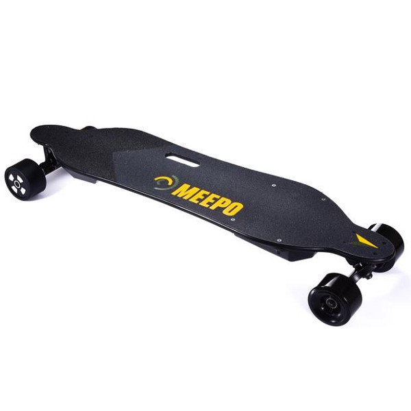

If you’ve been following my articles for a while, you’ll quickly notice that they’re all product reviews of some kind, but trust me when I say that none of them start that way. While I do admit I have a bit of an unhealthy relationship with consumerism, most of my stories start as a tale of investing in my lifestyle.

_But Eric, you_ **_have no_** _lifestyle. I haven’t seen you outside in years._

That’s what’s crazy about this new shit that I bought, it’s changed rather than augmented my lifestyle! Let me explain…

This is the Meepo Board v1.5. It’s a battery-powered longboard much like the popular Boosted Board. Here are the specs:

- 22 mph top speed
- Climbs 15-degree hills
- 18 mile range per charge
- \$619

Acceleration and braking is done through a handheld remote. Turning is done by rocking your body forward or backward, just like a regular longboard or snowboard.

A similarly spec’ed Boosted Board will run you \$1400, so how is this possible? Of course the parts aren’t as premium as the Boosted Board, but one of the main reasons for the low price is that this board was designed and produced in Shenzhen — the silicon valley of hardware. Access to electronics components, manufacturers, and people with the skills to prototype gizmos like this are so common, you can actually find similar products [very](https://ownboard.net/) [easily](https://wowgoboard.com/). The reason why I bought the Meepo Board, and what makes it stand out from the pack, is that the creator, Kieran, is a very trusted member of the electric skateboarding community.

Now, quality isn’t something you typically associate with Chinese goods, but I was quite shocked by how good the Meepo Board felt. The board has a decent flex to it, which helps with the bumpy roads, and the motors are just as powerful as they claim. Most of the downsides can be corrected with some inexpensive modifications, and at $619 (or $419 for the 11 mile range model), it’s the perfect price for my first electric skateboard.

#### Results

So how useful is it? As a Computer Science student at UVA, I take most of my classes in the Engineering School about a mile away from my apartment, which is about 13 minutes of walking. Walking isn’t unpleasant, especially on a nice day, but like many college students, I make the round-trip between home and class at least twice a day, in addition to club meetings, trips to the gym, and the occasional coffee date. The bus is usually the least-tiring way to get where I’m going, but it completely kills the ~20 minutes before and after your event. The wasted time really adds up, and I found myself less motivated to go to extracurricular events, get food between classes, or just to hang out.

Having an electric skateboard completely eliminates this problem. With it, I can make the trip to class in 4–5 minutes, and always on my schedule. No more standing around waiting for the bus and no more skipping meals because I didn’t have enough time to go home. But as mentioned, this newfound mobility has also motivated me to do more, like grabbing food more often with friends and going to places with scarce parking. I’ve gone to more free food events and extra-credit talks, and sometimes I just cruise around because it’s so exhilarating.

#### The Downside

But the holy art of electric skateboarding is not without flaws. For starters, I always avoid riding in or after the rain. The wheels just fling dirt and gravel all over your legs. And then there’s the wipeouts… It’s pretty common knowledge on college campuses that 100% of longboarders will eat shit at least once, and I’m no exception. In the first month, I fell twice, coincidentally in the same spot, and gave myself pretty nasty road rashes each time. Despite keeping to bike lanes and slow-moving roads, there’s just so many ways to get hurt, which is why I **always** wear my helmet.

And then there’s the hecklers…

Believe it or not, I have been heckled 4 times now, and each time it’s another variation of “stop being lazy!”. It’s always fun seeing the ways that people react to my longboard, even if they don’t always have the nicest things to say.

#### **Is this the Future?**

As much as I am having fun riding the Meepo Board around, I feel scared knowing that my next crash is just a matter of time, and that really is the crux of it. It’s so dangerous to be thrown off the board, especially when you’re going at speed, and it’s all in addition to the same perils that bikers and motorcyclists face. But just like the millions of people who ride bikes, skateboards, and other small vehicles to work and school, I will continue to ride my electric skateboard because it lets me spend less time walking and more time on productivity, especially when driving and parking are not an option. And compared to bikes, electric skateboards don’t need to be locked up.

As I await my next injury, I’ll leave you with this:

_The transportation infrastructure in America is some ass, and I’m reminded of this every time I travel to other countries with amazing subways and speedy trains that make smarter use of their cities. As we eagerly anticipate the arrival of self-driving cars and new transportation methods like the Hyperloop, it’s important to remember that because of the American love-hate relationship with cars, most people like me can’t even get to a public transit stop without driving. So unless you want everyone to live in high-rise closets, keep your fingers crossed that more people innovate with Last-Mile vehicles like the Meepo Board._
